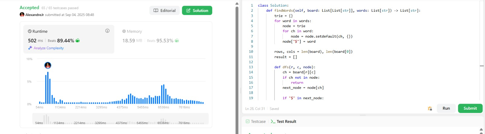
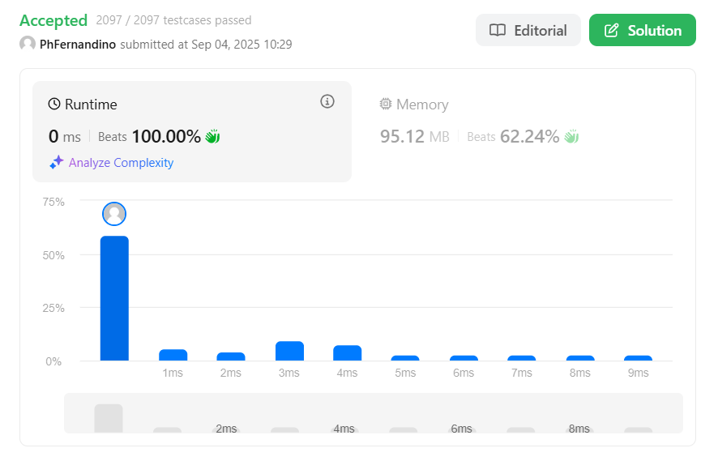
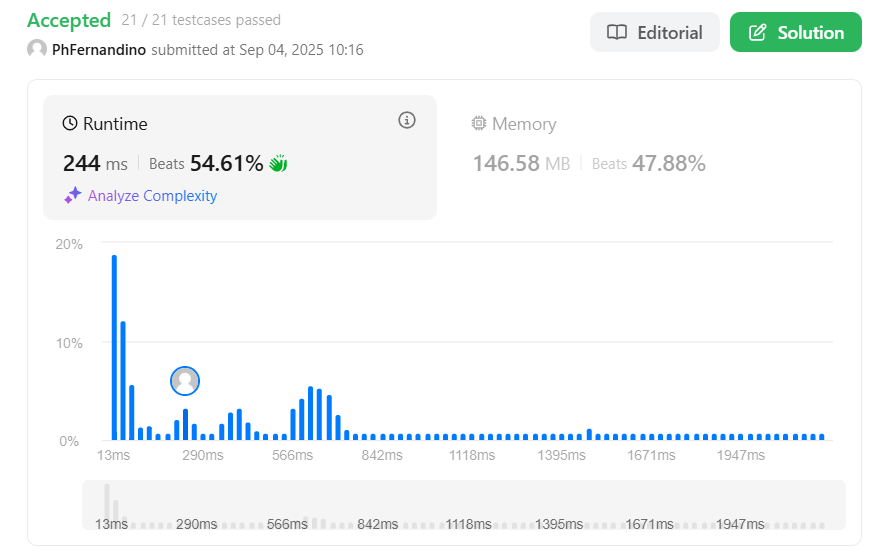

## Alunos  
| Matrícula | Nome |  
|-----------------------|---------------------|  
| 20/2015868 | Alexandre Lema Xavier Júnior |  
| 22/1031354| Pedro Henrique Fernandino da Silva |  

## Sobre 
Resolução de questões do LeetCode (2 difíceis e 2 médias) pelos integrantes do grupo com o objetivo de demonstrar o conhecimento adquirido nesse módulo (Algoritmos de Busca) da disciplina.

## Questões

|Questão | Dificuldade |
| -- | -- |
| [1268. Search Suggestions System](https://leetcode.com/problems/search-suggestions-system/description/)| Média |
| [212. Word Search II](https://leetcode.com/problems/word-search-ii/description/)| Difícil |
| [4. Median of Two Sorted Arrays](https://leetcode.com/problems/median-of-two-sorted-arrays/description/)| Difícil |
| [912. Sort an Array](https://leetcode.com/problems/sort-an-array/description/)| Media |

### [1268 - Média](https://leetcode.com/problems/search-suggestions-system/description/) 

A questão pedia um sistema de sugestões de produtos a partir de uma lista de palavras que, a cada caractere digitado, mostrasse até três produtos com o mesmo prefixo em ordem lexicográfica. Para resolver, os produtos foram ordenados e, para cada prefixo, usou-se busca binária para encontrar rapidamente as sugestões corretas. Foram selecionados no máximo três produtos que começassem com o prefixo digitado. Assim, a solução combinou ordenação com busca binária, garantindo eficiência e atendendo aos requisitos da questão.

### [212 - Difícil](https://leetcode.com/problems/word-search-ii/description/)

A questãoI pede para encontrar todas as palavras de uma lista que podem ser formadas em um tabuleiro de letras, movendo-se apenas horizontal ou verticalmente e sem repetir células. A solução usa uma Trie para armazenar as palavras e DFS com backtracking para percorrer o tabuleiro, explorando apenas caminhos que correspondem a algum prefixo na Trie e coletando as palavras completas encontradas.

### [4 - Difícil](https://leetcode.com/problems/search-suggestions-system/description/) 

O problema consiste em encontrar a mediana de dois arrays ordenados sem precisar fundi-los completamente. Para isso, utilizamos busca binária no menor array para localizar a partição correta, garantindo que todos os elementos à esquerda sejam menores ou iguais aos da direita. Essa abordagem tem complexidade O(log(min(m, n))) de tempo e O(1) de espaço, sendo a solução mais eficiente possível.

### [912 - Média](https://leetcode.com/problems/sort-an-array/description/) 

O problema pedia para ordenar um array de inteiros sem utilizar funções prontas de ordenação, garantindo um tempo de execução eficiente (O(nlogn)).
A solução foi implementada utilizando o Merge Sort, um algoritmo baseado na técnica de Divisão e Conquista. O vetor é recursivamente dividido em metades até restarem apenas subvetores de um elemento (que já estão ordenados). Em seguida, as metades são combinadas de forma ordenada, resultando no array final corretamente ordenado.

## Vídeo de explicação das Questões:

https://github.com/user-attachments/assets/9dc4a6eb-3b3a-43d4-8ce5-17d415ddda66

